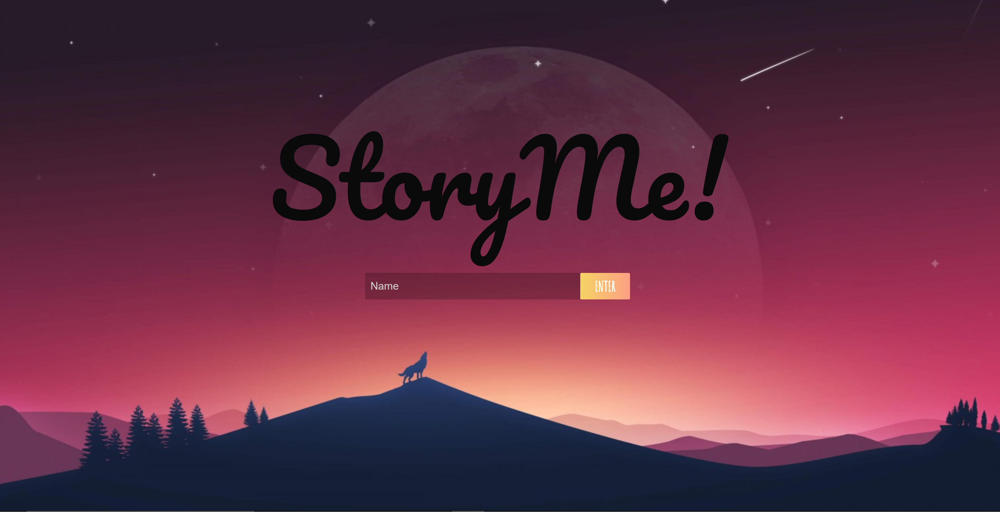

DESCRIPTION: StoryMe is a web application that allows multiple users to create a story collaboratively by taking turns writing sentences. After a certain number of entries, the app will offer to read the story aloud to the user. It can also analyze the text and tell the user whether the story has a positive or negative sentiment.

INSTRUCTIONS:
- Enter a user name, such as "Ford Prefect" or "Nikki Sixx," in the index field below the StoryMe logo. A small red message will appear above the input field. Read it, then click "proceed" to the right of the field.
- If you're the first person to start the session, you will see three choices in topics to get your creative juices flowing. Click on one. If you are not the first person, skip to the next step.
- A new text field will appear at the bottom of the screen. Also, a side bar on the right will appear listing the names of the users contributing to your story. If there are no names beside your own, nobody has yet joined your session.
- Once another player joins, write a sentence in the text field and click "enter." Your sentence will appear above. Then wait for another user to add another sentence to the story. Keep going until the app will no longer let you enter text.
- At this point, your input field will disappear and four buttons will appear in its place. "Reset" will reset the game. "Leave" will allow you to leave the current session and return to the first screen. "Read" will read the story to you aloud, and "sentiment" will analyze the text of your story and give you a score as a percentage measuring the sentiment. A higher score means your story has a positive tone, a lower score means it has a negative tone.

